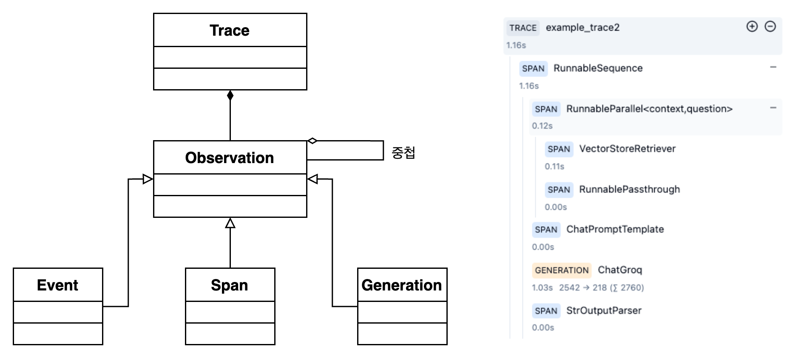

# 소개

<figure><figcaption></figcaption></figure>

### 왜 추적을 사용해야하나요?

* API 호출, 컨텍스트, 프롬프트, 병렬 처리 등을 포함하여 실행의 전체 컨텍스트를 캡처합니다.
* 모델 사용 및 비용 추적
* 사용자 피드백 수집
* 품질이 낮은 출력물 식별
* 미세 조정 및 테스트 데이터 세트 구축

### Observabilty와 Trace는 어떻게 구성해야하나요?

LangShark의 트레이스는 다음과 같이 구성됩니다.

<figure><figcaption></figcaption></figure>

#### Trace

#### 일반적으로 단일 요청 또는 작업을 나타냅니다. 여기에는 함수의 전체 입력 및 출력과 사용자, 세션 및 태그와 같은 요청에 대한 메타데이터가 포함됩니다.

#### Observation

각 추적에는 실행의 개별 단계를 기록하는 여러 개의 추적이 포함될 수 있습니다 .관찰에는 여러 유형이 있습니다.

#### Event

기본 빌딩 블록입니다. 추적에서 개별 이벤트를 추적하는 데 사용됩니다.

#### Span

추적에서 작업 단위의 기간을 나타냅니다.

#### Generation

AI 모델의 세대를 기록하는 데 사용되는 스팬입니다. \
여기에는 모델, 프롬프트 및 완료에 대한 추가 속성이 포함됩니다.\
토큰 사용 및 비용이 자동으로 계산됩니다.
