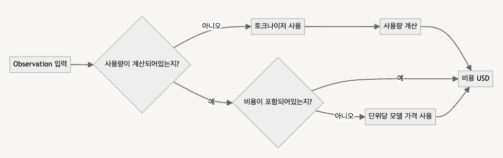

# 모델사용량 / 비용

## 개요

Langshark 상에서 모든 LLM에 대한 사용량과 비용은 추적 가능합니다.

* 사용량(Usage): Token / character counts
* 비용(Cost): 생성에 대한 USD 사용량과 비용

사용량과 비용은 다음과 같이 구성됩니다.

* API, SDK 또는 통합을 통해 **수집**
* 생성 시 `model` 매개변수를 기반으로 **추론됩니다**. Langshark는 OpenAI, Anthropic, Google 모델을 포함한 인기 있는 사전 정의된 모델 목록과 해당 토크나이저를 제공합니다. 또한 사용자 정의 모델 정의를 추가할 수 있으며, 지원되는 모델들은 추후 공식적으로 추가될 수 있습니다. 추론된 비용은 수집 시점에 계산됩니다.'

<figure><figcaption></figcaption></figure>

## **사용량 및/또는 비용 수집**

LLM 응답에서 사용 가능한 경우 사용량 및/또는 비용을 수집하는 것은 Langshark에서 사용량을 추적하는 가장 정확하고 강력한 방법입니다.

Langshark는 LLM 응답에서 사용량 및 비용 데이터를 자동으로 캡처합니다.



```python
@observe(as_type="generation")
def anthropic_completion(**kwargs):
  # optional, extract some fields from kwargs
  kwargs_clone = kwargs.copy()
  input = kwargs_clone.pop('messages', None)
  model = kwargs_clone.pop('model', None)
  langshark_context.update_current_observation(
      input=input,
      model=model,
      metadata=kwargs_clone
  )
 
  response = anthopic_client.messages.create(**kwargs)
 
  langshark_context.update_current_observation(
      usage={
          "input": response.usage.input_tokens,
          "output": response.usage.output_tokens,
          # "total": int,  # if not set, it is derived from input + output
          "unit": "TOKENS", # any of: "TOKENS", "CHARACTERS", "MILLISECONDS", "SECONDS", "IMAGES"
 
          # Optionally, also ingest usd cost. Alternatively, you can infer it via a model definition in Langfuse.
          # Here we assume the input and output cost are 1 USD each.
          "input_cost": 1,
          "output_cost": 1,
          # "total_cost": float, # if not set, it is derived from input_cost + output_cost
      }
  )
 
  # return result
  return response.content[0].text
 
@observe()
def main():
  return anthropic_completion(
      model="claude-3-opus-20240229",
      max_tokens=1024,
      messages=[
          {"role": "user", "content": "Hello, Claude"}
      ]
  )
 
main()L
```



LangChain 통합 시 자동으로 계산됩니다.



LlamaIndex 통합 시 자동으로 계산됩니다.



### **사용량 및/또는 비용 추론**

Langshark는 사용량 또는 비용이 수집되지 않으면 `model` 의 응답을 수집하는 시점의 생성 매개변수를 기반으로 누락된 값을 추론하려고 시도합니다. 이는 응답에 사용량 또는 비용을 포함하지 않는 일부 모델 공급자 또는 자체 호스팅 모델에 특히 유용합니다.

**Langfuse에는 OpenAI, Anthropic, Google을** 포함한 **사전 정의된 인기 모델과 토크나이저 목록이** 제공됩니다 .

사용자 **정의 모델 정의를** 추가하거나 공식 모델을 지원 요청할 수 있습니다.

#### **비용**

모델 정의에는 단위당 가격(입력, 출력, 총계)이 포함됩니다.

(1) 사용량이 수집되거나 추론

(2) 일치하는 모델 정의에 가격이 포함된 경우

해당 데이터를 수집 시점에 정의된 모델의 대한 비용으로 자동 계산합니다.

#### **사용자 정의 모델 정의**

사용자 정의 모델의 비용을 계산해야하는 경우 커스텀 모델 정의를 통해 구성할 수 있습니다. 자체 호스팅 또는 파인튜닝 된 모델 또한 호출시 등록된 모델 이름을 통해 수집하여 계산됩니다.

<figure><figcaption></figcaption></figure>

모델은 다음을 기준으로 세대에 맞게 매칭됩니다.

<table data-header-hidden><thead><tr><th width="162"></th><th width="177"></th><th></th></tr></thead><tbody><tr><td><strong>생성 속성</strong></td><td><strong>모델 속성</strong></td><td><strong>노트</strong></td></tr><tr><td><code>model</code></td><td><code>match_pattern</code></td><td>정규 표현식을 사용합니다.<br>(예: <code>(?i)^(gpt-4-0125-preview)$</code>일치) <code>gpt-4-0125-preview</code>.</td></tr><tr><td><code>unit</code></td><td><code>unit</code></td><td>세대의 사용 객체에 대한 단위(예: <code>TOKENS</code>또는 <code>CHARACTERS</code>)가 일치해야 합니다.</td></tr><tr><td><code>start_time</code></td><td><code>start_time</code></td><td>선택 사항으로, 이전 세대에 영향을 미치지 않고 모델의 가격을 업데이트하는 데 사용할 수 있습니다. 여러 모델이 일치하는 경우, 가장 최근 모델 <code>model.start_time</code>이 있는 모델이 <code>generation.start_time</code>사용됩니다.</td></tr></tbody></table>

